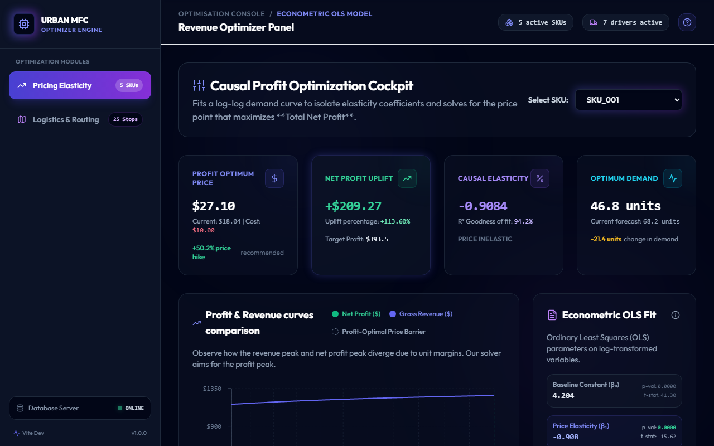
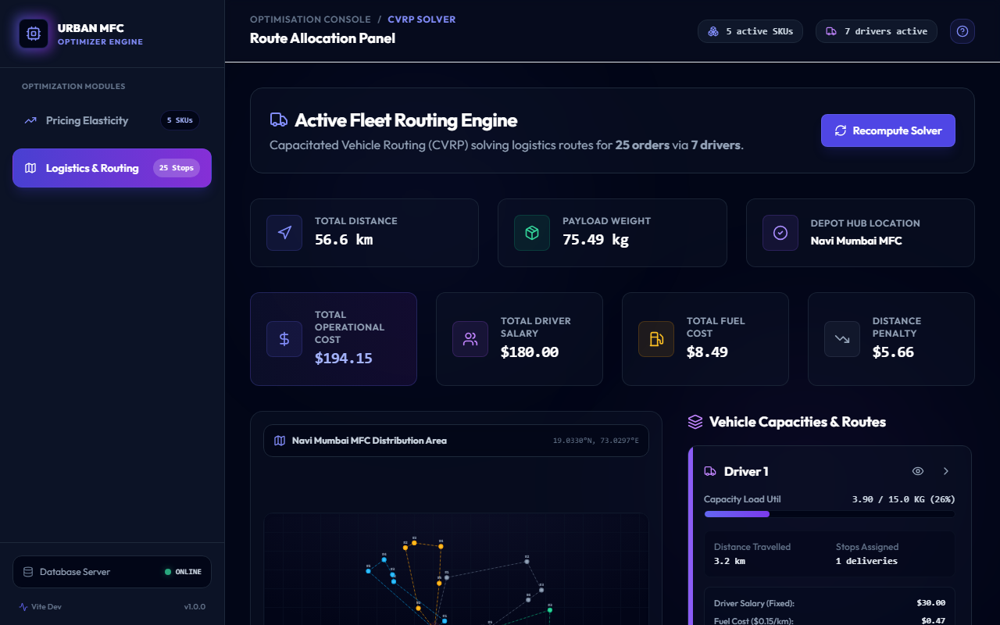
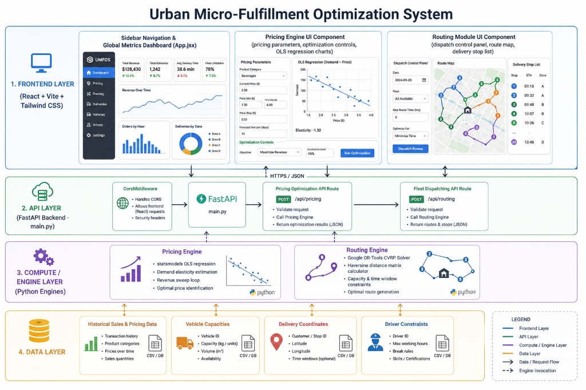

# 🏬 Urban Micro-Fulfillment Optimization System (UMFOS)

An end-to-end SaaS optimization platform that leverages **Econometric Modeling (OLS)** and **Operations Research (Capacitated Vehicle Routing)** to maximize profit margins and optimize last-mile logistics for urban micro-fulfillment hubs.

---

## 🚀 Key Value Proposition & Business Impact
In urban delivery setups, pricing and route dispatching are usually solved in silos. **UMFOS** unifies these two engines to optimize the bottom-line:
1. **Dynamic Econometric Pricing**: Retrains an Ordinary Least Squares (OLS) regression model on sales history to calculate price elasticity. It sweeps prices dynamically to select the price that maximizes overall profit (accounting for holding penalties and item costs).
2. **Capacitated Fleet Dispatching**: Resolves the NP-hard Capacitated Vehicle Routing Problem (CVRP) using Google OR-Tools, ensuring 100% service fulfillment with minimal transit distance and vehicle wear-and-tear under strict payload constraints.

---

## 🖥️ Live Dashboard UI & Screenshots

### 1. Pricing Engine & Elasticity Simulator
*Features real-time parameter tuning, OLS regression curve visualizations, and what-if simulators for demand, revenue, and profit margins.*



### 2. Fleet Routing & Geographic Dispatch Module
*Visualizes interactive delivery routes, payload distribution per driver, route transit logs, and custom optimizer configurations.*



---

## 📊 System Architecture & Data Flows

### Architecture Diagram
The system is built using a decoupled, multi-layer service structure:



* **Frontend Layer (React + Vite + Tailwind CSS)**: Modular SPA structure featuring dynamic sliders, SVG-based route visualization maps, and metric summary cards.
* **API Gateway (FastAPI Backend)**: A high-performance Python web framework supplying RESTful JSON endpoints, validation schemas, and CORS handling.
* **Compute / Optimization Engines**:
  * **Pricing Engine**: Integrates `statsmodels` for log-log regression estimation and dynamic revenue sweep loops.
  * **Routing Engine**: Leverages Google `OR-Tools` CP solver with Haversine distance matrix calculators to find optimal transit paths.
* **Data Layer**: Structured local storage using parquet data logs (`transactions.parquet` & `pending_deliveries.parquet`) simulating database tables.

---

## 🔄 User Journey & Operations Flow

This flow-chart traces the actions an Operations Hub Manager takes to execute end-to-end optimizations:


---

## 🛠️ The Tech Stack

| Component | Technology | Description |
|---|---|---|
| **Frontend UI** | React 18, Vite, Tailwind CSS | Ultra-fast rendering SPA, Glassmorphism design system, responsive layout. |
| **Charts & Graphics** | Recharts, Custom SVGs | Interactive OLS curve visualization, interactive vehicle route maps. |
| **Backend Framework** | FastAPI (Python) | Async HTTP server with automatic Pydantic request validation and Swagger docs. |
| **Statistical Computations** | Statsmodels, Pandas, NumPy | Log-Log Ordinary Least Squares (OLS) regression models and data wrangling. |
| **Combinatorial Solvers** | Google OR-Tools (Routing) | Capacitated Vehicle Routing Problem (CVRP) solver using Guided Local Search. |
| **Quality & QA** | Playwright (Python) | Automated headless browser interactions and confirmation screenshot captures. |

---

## 🧮 Mathematical & Algorithmic Formulation

### 1. Price Elasticity Econometric Model
The demand forecasting model is trained using a log-log Ordinary Least Squares (OLS) regression formulation:

\[\ln(\text{Quantity Sold} + 1) = \beta_0 + \beta_1 \ln(\text{Price}) + \beta_2 \ln(\text{Competitor Price}) + \beta_3 \text{Promotion Active} + \sum \beta_i \text{Contextual Features}\]

* **Elasticity Coefficient (\(\beta_1\))**: Quantifies how sensitive demand is to price changes.
* **Revenue Sweep Optimizer**: Evaluates a range of pricing variants \(P\) (50% to 150% of the current price) to solve for the maximum net profit:
  \[\text{Profit}(P) = (P - \text{Cost}) \times \min(\text{Inventory}, \text{Predicted Demand}(P)) - \text{Holding Cost} \times \max(0, \text{Inventory} - \text{Predicted Demand}(P))\]

### 2. Capacitated Vehicle Routing (CVRP) Optimization
Given a set of delivery nodes \(N\), vehicle fleet \(V\), and homogeneous capacity \(Q\):
* **Objective**: Minimize total operational transit costs and fixed vehicle utilization fees.
  \[\text{Minimize } \sum_{i \in N} \sum_{j \in N} \sum_{v \in V} c_{ij} x_{ijv} + \sum_{v \in V} F_v y_v\]
  *Where \(c_{ij}\) is the distance, \(x_{ijv}\) is the path selection indicator, \(F_v\) is the driver's fixed cost, and \(y_v\) is a vehicle activation flag.*
* **Constraints**:
  * Every customer stop is visited exactly once by one vehicle.
  * The total payload weight delivered on any route must not exceed the driver capacity limit \(Q\).

---

## 📂 Codebase Layout

```
├── backend/
│   ├── api/                # Sub-modules for routers, schemas, and config files
│   ├── database/           # Local parquet mock database interface
│   ├── engines/
│   │   ├── optimization.py # Baseline optimization wrappers
│   │   ├── pricing.py      # Statsmodels OLS + Revenue Variant Sweep loop
│   │   └── routing.py      # OR-Tools CVRP solver + Haversine Matrix Calculator
│   ├── services/           # AI insights and explainability logic
│   ├── utils/              # Calculation helpers (Haversine formulas)
│   ├── main.py             # FastAPI backend router with CORS support
│   └── Dockerfile          # Production backend Docker image definition
├── frontend/               # Modular React application 
│   ├── src/
│   │   ├── components/     # PricingEngine, RoutingModule components
│   │   ├── App.jsx         # Sidebar nav + Global metrics dashboard
│   │   ├── index.css       # Glassmorphic themes & styling definitions
│   │   └── main.jsx        # App bootstrapper
│   ├── package.json        # Frontend configuration and npm dependencies
│   ├── tailwind.config.js  # Tailwind CSS definitions
│   └── vite.config.js      # Vite dev server config + API proxy configs
├── docs/                   # System design & review documentation
│   └── images/             # Visual diagrams and UI screenshots
├── scripts/                # Utility and test scripts
│   ├── generate_mock_data.py
│   └── verify_backend.py   # Automated unit test suite for Python engines & endpoints
├── capture_screenshots.py  # Playwright browser automation screenshot script
├── docker-compose.yml      # Local containerized orchestration configuration
└── README.md               # Operations manual & recruiter overview (this file)
```

---

## ⚙️ Installation & Setup

### 1. Prerequisites
Verify that you have the following software installed:
* **Python 3.10+**
* **Node.js v18+** (with npm)

---

### 2. Backend Setup & Run

1. **Install Python Packages**:
   ```bash
   pip install pandas pyarrow statsmodels "ortools<9.11" fastapi uvicorn playwright
   python -m playwright install chromium
   ```

2. **Generate Mock Data**:
   Pre-populate the database parquet tables with transactional and delivery history:
   ```bash
   python scripts/generate_mock_data.py
   ```

3. **Start FastAPI Backend Server**:
   ```bash
   python backend/main.py
   ```
   *The Swagger interactive documentation will be available at: `http://127.0.0.1:8000/docs`.*

---

### 3. Frontend Setup & Run

1. **Install Dependencies**:
   ```bash
   cd frontend
   npm install
   ```

2. **Start Vite Dev Server**:
   ```bash
   npm run dev
   ```
   *Open `http://localhost:5173` in your browser to interact with the SaaS dashboard.*

---

## 🧪 Testing & Automated Verification

Ensure that the compute engines and REST endpoints operate within strict mathematical parameters:

1. **Run Backend Test Suite**:
   ```bash
   python scripts/verify_backend.py
   ```
   *Verifies OLS slope coefficients, negative elasticity constraints, route feasibilities, and API endpoint codes.*

2. **Run Headless Browser Interaction Tests**:
   Ensure the frontend UI compiles, connects to the backend, and renders charts correctly:
   ```bash
   python capture_screenshots.py
   ```
   *Uses Playwright to boot a browser instance, verify live API data states, and capture PNG representations of the tabs.*
