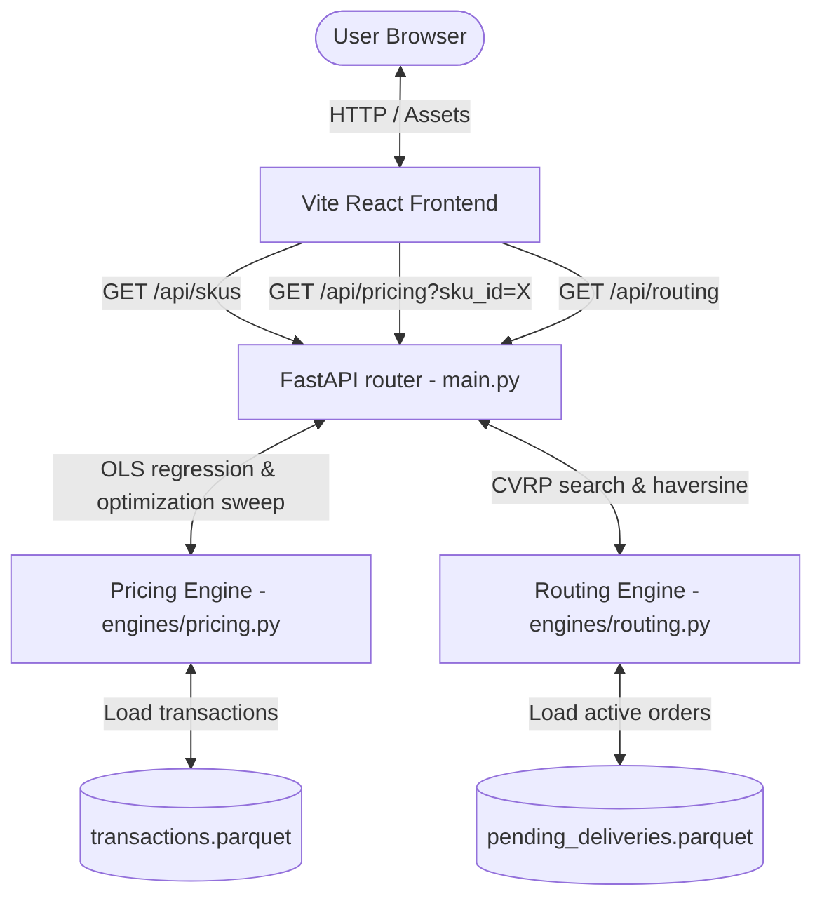

# Yo, Welcome to the Urban Micro-Fulfillment Optimizer! 🚀

If you’ve ever wondered how companies like Amazon, Uber, or local hyper-delivery startups manage to price their items perfectly and get delivery drivers to your door without wasting gas, you're in the right place. 

This project is a mini-version of those exact corporate brains. We built a high-performance optimization system that does two super smart things:
1. **Dynamic Pricing (OLS Regression)**: It looks at historical sales data, figures out how sensitive customers are to price changes, and picks the exact price sweet spot that pulls in the absolute maximum revenue.
2. **Logistics Routing (CVRP Solver)**: It takes a list of pending packages, calculates their locations on the map, and assigns them to a fleet of drivers so that no driver carries more than 15 KG, and the total distance driven is as short as humanly possible.

Let’s break down how it works, how the tech pieces fit together, and the math powering the engines under the hood!

---

## 🛠️ The Tech Stack (Who does what?)

We split this project into a **FastAPI backend** (the calculations brain) and a **React.js frontend** (the visual cockpit). 

Here is a look at the tools we chose and why:

*   **FastAPI (Python)**: Our web server framework. It is lightning-fast, uses modern Python type hints, and automatically documents endpoints.
*   **Statsmodels (Python)**: The math library we use for statistical modeling. It runs the Ordinary Least Squares (OLS) regression to calculate price sensitivity.
*   **Google OR-Tools (C++/Python)**: Google's open-source optimization suite. It handles the crazy routing math (Capacitated Vehicle Routing Problem) to dispatch the driver fleet.
*   **Pandas & PyArrow (Python)**: Used to load and process `.parquet` files (a highly compressed columnar file format standard in big-data engineering).
*   **Vite + React (JavaScript)**: A blazing-fast frontend bundler running React. React handles the UI components dynamically without reloading the page.
*   **Tailwind CSS**: A utility-first CSS framework. It lets us style the frontend directly in the HTML tags, keeping things clean and modular.
*   **Recharts**: A charting library for React. It draws the beautiful revenue curves.
*   **Custom SVG Canvas**: We used plain inline SVGs to draw the interactive GIS map of Navi Mumbai since it’s offline-friendly, interactive, and doesn't require expensive Google Maps API keys!

---

## 📐 The Math Behind the Engines

Don't panic! We’re going to break this math down into plain terms. It’s actually pretty intuitive once you see the logic.

### 1. The Pricing Math: OLS Regression & Demand Elasticity 📊

Imagine you run a lemonade stand. If you charge $1.00, you sell 100 cups. If you raise the price to $5.00, you might only sell 5 cups. The connection between *price* and *demand* (quantity sold) is called **Price Elasticity**. 

To find this connection in our transaction history, we run an **Ordinary Least Squares (OLS)** linear regression. The equation looks like this:

$$\text{Demand} = \beta_0 + \beta_1(\text{Price}) + \beta_2(\text{Competitor\_Price}) + \beta_3(\text{Promotion\_Active})$$

Here’s what these terms mean in the real world:
*   **$\beta_0$ (Intercept)**: The baseline demand. How many items we would sell if everything else was zero.
*   **$\beta_1$ (Price Elasticity)**: The slope of our price impact. Because of the law of demand, **$\beta_1$ will always be negative** (e.g. $-4.72$). This tells us: *"For every dollar we raise our price, we lose about 4.7 units of sales."*
*   **$\beta_2$ (Competitor Price)**: How much the competitor’s price impacts us. This is usually positive (e.g. $+3.0$). If our competitor raises their price, customers flee to us, and our demand goes up!
*   **$\beta_3$ (Promotion Active)**: The sales bump we get when we run a promo (like a banner ad or discount code). Usually positive (e.g. $+15.0$ units).

#### The Sweep Optimization Loop
Once `statsmodels` solves the regression and gives us the exact numbers for $\beta_0, \beta_1, \beta_2,$ and $\beta_3$, our backend starts a sweeping loop. 
It looks up the **current price** (the latest price recorded in the dataset), and sweeps a range from **50% of the current price** to **150% of the current price** in **$0.10 steps**.

For each candidate price $P$:
1. It predicts the sales quantity: $\hat{Q} = \beta_0 + \beta_1 \cdot P + \beta_2 \cdot \overline{Comp} + \beta_3 \cdot \overline{Promo}$ (holding competitor prices and promotions constant at their average values).
2. It calculates expected revenue: $\text{Revenue} = P \cdot \hat{Q}$.
3. It keeps track of the price $P$ that gives the **Maximum Revenue**. That is our recommended **Optimal Price**!

---

### 2. The Logistics Math: Haversine Distance & CVRP 🚚

Now let’s look at delivery routing. The problem is simple: we have a depot (Fulfillment Center) in Navi Mumbai, and 25 customers scattered around it. Each customer has a package with a specific weight (e.g., 2.3 KG, 5.1 KG). We have a fleet of delivery drivers, but **no driver can carry more than 15.0 KG in their vehicle** (strict capacity limit). How do we route them?

This is called the **Capacitated Vehicle Routing Problem (CVRP)**, and it's a famous NP-hard problem (which means it's mathematically impossible to find the perfect solution instantly by checking every combination, so we use heuristics/solvers to find a near-perfect route in seconds).

#### Step A: Lat/Lng Distance (The Haversine Formula)
Before routing, we need to know the distance between every single pair of points. Because the earth is a sphere and not flat, we can't just use simple $x, y$ Pythagorean geometry. We use the **Haversine Formula** to find the distance along the earth's curve:

$$d = 2 R \arcsin\left(\sqrt{\sin^2\left(\frac{\Delta \text{lat}}{2}\right) + \cos(\text{lat}_1)\cos(\text{lat}_2)\sin^2\left(\frac{\Delta \text{lng}}{2}\right)}\right)$$

Where:
*   $R = 6371.0\text{ km}$ (the radius of the Earth).
*   $\text{lat}_1, \text{lng}_1$ and $\text{lat}_2, \text{lng}_2$ are coordinates converted to radians.

We compute this dynamically for all 26 nodes (1 depot + 25 customers) to generate a $26 \times 26$ **Distance Matrix**.

#### Step B: Google OR-Tools CVRP Solver
We pass the distance matrix and the package weights to the Google OR-Tools solver:
1. We scale package weights by 100 (e.g. 2.45 KG becomes 245 units) so the solver can work with clean integers.
2. We tell the solver: *"We have $N$ drivers, each driver has a capacity of 1500 units (15.0 KG). The depot is node index 0."*
3. The solver runs a search algorithm called **Guided Local Search**. It starts with a simple routing guess, and iteratively tweaks the paths—swapping stops between drivers—until it minimizes the total distance driven across the entire fleet without any driver exceeding the 15.0 KG load.
4. **Self-Healing Fleet Scaling**: Because the total weight of all 25 packages in our dataset adds up to 89.59 KG, 4 drivers carrying 15 KG each ($4 \times 15 = 60\text{ KG}$) can never complete the job. Our code automatically detects this capacity mismatch and scales the driver fleet up (to 7 drivers) so that the routing remains mathematically possible!

---

## 🗺️ Project Directory Tour

Here’s where all the code lives:

*   [`engines/pricing.py`](file:///C:/Users/user/OneDrive/Desktop/Project/engines/pricing.py): The Python module running the statsmodels OLS regression and pricing sweep loops.
*   [`engines/routing.py`](file:///C:/Users/user/OneDrive/Desktop/Project/engines/routing.py): The Python module computing the Haversine matrix and running the OR-Tools CVRP solver.
*   [`main.py`](file:///C:/Users/user/OneDrive/Desktop/Project/main.py): The FastAPI web server. It maps endpoints (`/api/pricing` and `/api/routing`) to the Python engines and formats their outputs into clean JSON.
*   [`frontend/src/App.jsx`](file:///C:/Users/user/OneDrive/Desktop/Project/frontend/src/App.jsx): The frontend cockpit wrapper. It handles the sidebar navigation and checks whether the backend is online.
*   [`frontend/src/components/PricingEngine.jsx`](file:///C:/Users/user/OneDrive/Desktop/Project/frontend/src/components/PricingEngine.jsx): Renders the interactive pricing slider, econometric statistics table, and the Recharts revenue sweep graph.
*   [`frontend/src/components/RoutingModule.jsx`](file:///C:/Users/user/OneDrive/Desktop/Project/frontend/src/components/RoutingModule.jsx): Projects latitudes and longitudes onto a custom interactive SVG map layout, draws animated route lines color-coded by driver, and displays real-time capacity progress bars.

---

## ⚙️ System Architecture

Here is how the data and requests flow between components:

---

## 🕹️ How to Use It

Open the dashboard in your web browser (usually at **http://localhost:5173**). Here is what you can do:

### Tab 1: Pricing Elasticity Tab
1. **Pick an SKU**: Use the dropdown in the top-right corner to switch between SKUs (SKU_001 to SKU_005).
2. **Read the KPIs**: 
   * **Recommended Price**: Shows what you should charge.
   * **Revenue Uplift**: Tells you how much *extra* money you will make compared to what you charge now.
   * **Demand Elasticity**: Shows the $\beta_1$ coefficient. If it's negative and high, customers are super sensitive to price changes!
3. **Analyze the Curve**: Hover over the line chart. The green dot marks the revenue peak. Hovering over the line shows you predicted demand and revenue at that specific price.
4. **Check the OLS Table**: Look at the bottom-right table. It shows the coefficients, t-stats, and p-values. If the p-value is less than 0.05, that factor is statistically significant!

### Tab 2: Logistics & Fleet Routing Tab
1. **Interact with the Map**: Hover over any of the customer nodes (circles) on the Navi Mumbai map. An overlay will pop up at the bottom showing the Order ID, coordinates, stop sequence number, and package weight.
2. **Filter Driver Visibility**: Look at the legend at the bottom of the map. Click on any driver button (e.g., "driver 1") to hide or show their route lines.
3. **Inspect Vehicle Payload**: Look at the right sidebar. Each card shows a driver’s statistics:
   * **Capacity Utilization Bar**: Fills up with color (green to red) indicating how close the driver is to the 15.0 KG limit.
   * **Stops Sequence**: Click the arrow on the right side of any driver card to expand their sequential list of deliveries and look up stop-by-stop details.
